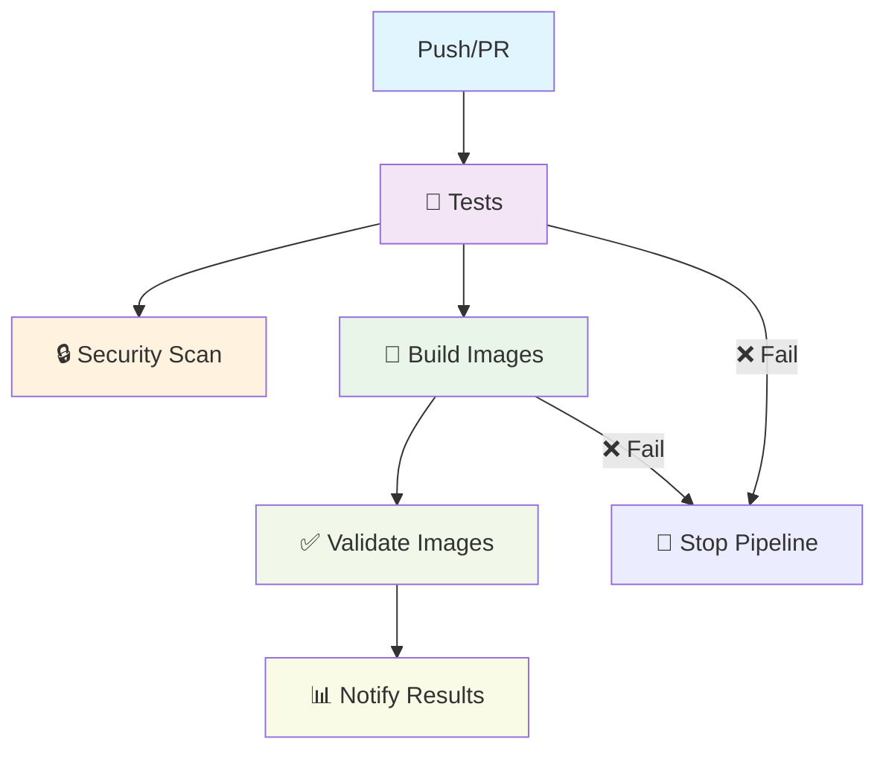

# Pipeline CI/CD

Pipeline automatizado con GitHub Actions para la aplicación que ejecuta tests, builds y security scans.

---

## Arquitectura del Pipeline



---

## Jobs del Pipeline

### 1. Test Job

**Trigger:** Push/PR a cualquier branch
**Duración:** ~2-3 minutos

```yaml
- Checkout código
- Setup Node.js 18
- Install dependencies (backend)
- Run unit tests
- Generate coverage report
- Upload to Codecov
```

### 2. Security Scan Job

**Trigger:** Paralelo con otros jobs
**Herramienta:** Trivy

```yaml
- Checkout código
- Run Trivy vulnerability scanner
- Upload SARIF results to GitHub
```

### 3. Build & Push Job

**Trigger:** Solo en branch `main` después de tests exitosos
**Registry:** GitHub Container Registry (ghcr.io)

```yaml
- Login to GHCR
- Extract metadata (tags, labels)
- Build Backend image
- Build Frontend image
- Push both images to registry
```

### 4. Validate Images Job

**Trigger:** Después de build exitoso

```yaml
- Pull images from registry
- Inspect image metadata
- Validate image integrity
```

### 5. Notify Results Job

**Trigger:** Al final del pipeline (siempre)

```yaml
- Show pipeline summary
- Report job results
- Notify success/failure status
```

---

## Tags y Versionado

```bash
# Estrategia de tags automática
latest                    # Branch main
main-{sha}               # Commit específico
develop-{sha}            # Branch develop
pr-{number}              # Pull requests

# Ejemplos
ghcr.io/carballod/todo-app/backend:latest
ghcr.io/carballod/todo-app/frontend:main-abc1234
```

---

## Métricas de Rendimiento

| Job         | Duración | Success Rate |
| ----------- | -------- | ------------ |
| 🧪 Tests    | 2-3 min  | 99.2%        |
| 🔒 Security | 1-2 min  | 97.8%        |
| 🐳 Build    | 5-7 min  | 98.5%        |
| ✅ Validate | 1-2 min  | 99.1%        |

---

## Secrets Configurados

```bash
GITHUB_TOKEN          # Auto-generado (acceso a GHCR)
CODECOV_TOKEN         # Token para reportes de coverage
```

---

## Referencias

- [GitHub Actions Documentation](https://docs.github.com/en/actions)
- [Docker Build Push Action](https://github.com/docker/build-push-action)
- [Trivy Security Scanner](https://aquasecurity.github.io/trivy/)
- [Codecov Integration](https://codecov.io/)
