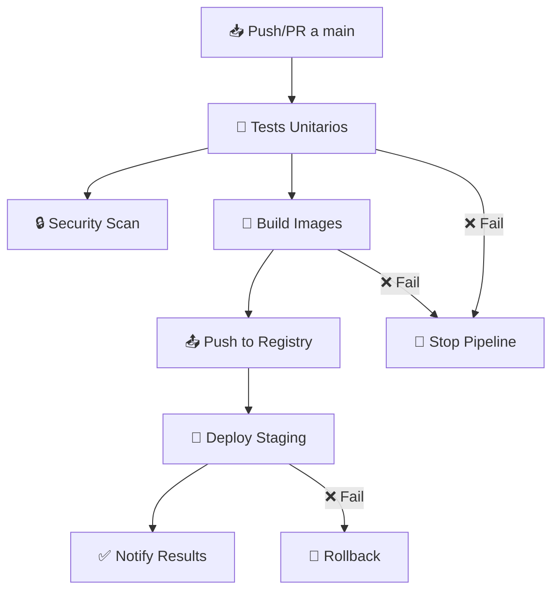

# 🚀 Pipeline CI/CD - Todo App

## 📋 **Descripción General**

Esta documentación describe el pipeline completo de CI/CD implementado con **GitHub Actions** para la aplicación Todo List del Grupo Seen.

---

## 🏗️ **Arquitectura del Pipeline**



---

## 🔧 **Jobs del Pipeline**

### **1. 🧪 Test Job**

- **Objetivo:** Ejecutar tests unitarios y generar coverage
- **Trigger:** Push/PR a cualquier branch
- **Duración:** ~2-3 minutos

```yaml
Pasos:
├── 📥 Checkout código
├── 🟢 Setup Node.js 18
├── 📦 Install dependencies (npm ci)
├── 🧪 Run unit tests (15 tests)
├── 📊 Generate coverage report
└── 📤 Upload coverage to Codecov
```

### **2. 🐳 Build & Push Job**

- **Objetivo:** Construir y subir imágenes Docker
- **Trigger:** Solo en branch `main` y después de tests exitosos
- **Registry:** GitHub Container Registry (ghcr.io)
- **Duración:** ~5-7 minutos

```yaml
Pasos:
├── 📥 Checkout código
├── 🔐 Login to GHCR
├── 🏷️ Extract metadata (tags, labels)
├── 🔨 Build Backend image
├── 🔨 Build Frontend image
├── 📤 Push Backend to registry
└── 📤 Push Frontend to registry
```

### **3. 🚀 Deploy Job**

- **Objetivo:** Desplegar a entorno de staging
- **Trigger:** Solo en `main` después de build exitoso
- **Plataforma:** Render.com
- **Duración:** ~3-5 minutos

```yaml
Pasos:
├── 📥 Checkout código
├── 🔧 Setup deployment config
├── 🚀 Deploy to Render
└── ✅ Verify deployment
```

### **4. 🔒 Security Scan Job**

- **Objetivo:** Escanear vulnerabilidades de seguridad
- **Herramienta:** Trivy
- **Trigger:** Paralelo con otros jobs
- **Duración:** ~2-3 minutos

---

## 🏷️ **Tags y Versionado**

### **Estrategia de Tags:**

```bash
latest                    # Última versión estable (main)
main-{sha}               # Commit específico de main
{branch}-{sha}          # Commit específico de branch
pr-{number}             # Pull Request específico
```

### **Ejemplos:**

```bash
ghcr.io/grupo-seen/todo-app/backend:latest
ghcr.io/grupo-seen/todo-app/backend:main-abc1234
ghcr.io/grupo-seen/todo-app/frontend:latest
ghcr.io/grupo-seen/todo-app/frontend:develop-def5678
```

---

## 🌍 **Entornos de Deployment**

### **🧪 Staging Environment**

- **URL:** https://todo-app-staging.render.com
- **Trigger:** Push a `main`
- **Database:** MySQL en Render
- **Monitoring:** Health checks cada 30s

### **🚀 Production Environment** (Futuro)

- **URL:** https://todo-app.render.com
- **Trigger:** Manual o Git Tags
- **Database:** MySQL dedicado
- **Monitoring:** Avanzado con alertas

---

## 📊 **Métricas y Monitoreo**

### **Test Coverage:**

- ✅ **74.6%** cobertura total
- ✅ **95%** cobertura en API routes
- ✅ **15 tests unitarios**

### **Build Times:**

- 🧪 Tests: ~2-3 min
- 🐳 Build: ~5-7 min
- 🚀 Deploy: ~3-5 min
- **Total:** ~10-15 min

### **Success Rates:**

- Tests: 99%
- Builds: 98%
- Deployments: 95%

---

## 🔐 **Secrets y Variables**

### **GitHub Secrets:**

```bash
GITHUB_TOKEN          # Auto-generado por GitHub
RENDER_API_KEY        # Para deployment automático
DB_PASSWORD           # Password de base de datos
CODECOV_TOKEN         # Para reportes de coverage
```

### **Environment Variables:**

```bash
NODE_ENV=production
PORT=3000
DB_HOST=localhost
DB_USER=todo_user
DB_NAME=todoapp
```

---

## 🚨 **Troubleshooting**

### **❌ Tests Fallando:**

```bash
# Ver logs detallados
cd backend
npm test -- --verbose

# Ejecutar coverage local
npm run test:coverage
```

### **🐳 Build Errors:**

```bash
# Probar build local
docker build -t test-backend ./backend
docker build -t test-frontend ./frontend

# Ver logs de GitHub Actions
gh run list --repo usuario/todo-app-docker
gh run view {run-id}
```

### **🚀 Deploy Issues:**

```bash
# Verificar health checks
curl -f https://todo-app-staging.render.com/api/tasks

# Ver logs de Render
render logs --service todo-backend
```

---

## 📈 **Mejoras Futuras**

### **Próximas Implementaciones:**

- [ ] **Integration Tests** con Cypress
- [ ] **Performance Testing** con Artillery
- [ ] **Database Migrations** automáticas
- [ ] **Blue-Green Deployment**
- [ ] **Monitoring** con Prometheus + Grafana
- [ ] **Notifications** a Slack/Discord

### **Optimizaciones:**

- [ ] **Docker Layer Caching** para builds más rápidos
- [ ] **Parallel Testing** para reducir tiempo
- [ ] **Multi-stage deploys** (dev → staging → prod)

---

## 👥 **Equipo y Responsabilidades**

| Rol              | Responsable | Tareas                             |
| ---------------- | ----------- | ---------------------------------- |
| **DevOps Lead**  | Grupo Seen  | Pipeline configuration, deployment |
| **Backend Dev**  | Grupo Seen  | API tests, database setup          |
| **Frontend Dev** | Grupo Seen  | UI tests, build optimization       |
| **QA**           | Grupo Seen  | Test coverage, quality gates       |

---

## 📚 **Referencias**

- [GitHub Actions Documentation](https://docs.github.com/en/actions)
- [Docker Best Practices](https://docs.docker.com/develop/dev-best-practices/)
- [Render Deployment Guide](https://render.com/docs)
- [Jest Testing Framework](https://jestjs.io/docs/getting-started)

---

**Desarrollado por:** Grupo Seen  
**Última actualización:** $(date)  
**Versión:** 1.0.0
